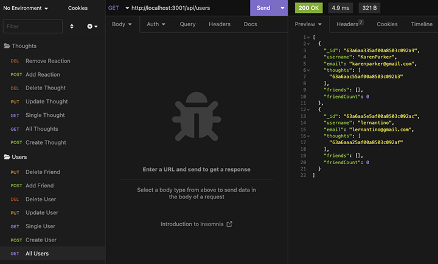
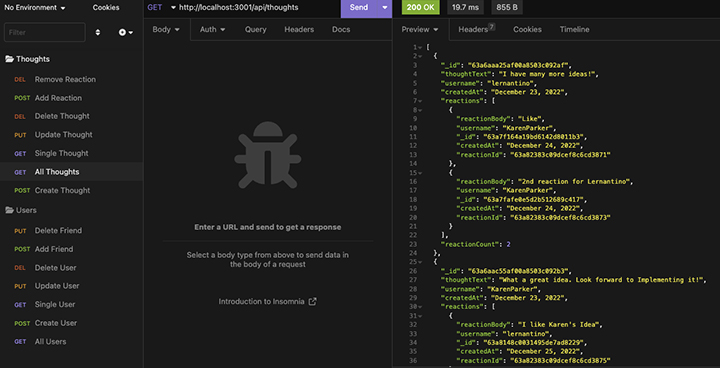

# Social Network
Social Network API using NoSQL

UCLA Bootcamp Challenge  - Module 18

Due Date 12/22/2022

## Challenge Tasks

Build an API for a social network web application where users can share their thoughts, react to friends’ thoughts, and create a friend list. App uses Express.js for routing, a MongoDB database, and the Mongoose ODM.

## Acceptance Criteria
- Enter the command to invoke the application and the server is started and the Mongoose models are synced to the MongoDB database
- Open the API GET routes in Insomnia for users and thoughts. The data for each of these routes is displayed in a formatted JSON
- following 2 image shows insomnia and JSON results:

- Testing API POST, PUT, and DELETE routes in Insomnia successfully create, update, and delete users and thoughts and in my database.
- Create and delete reactions to thoughts and add and remove friends to a user’s friend list
- test API POST and DELETE routes in Insomnia for friends and reactions

## Video
You can see a video demonstration for this app [here]()

## GitHub 
ReRepository for Social Network application can be found at: [GitHub](https://github.com/Me-ross/socialNetwork)
